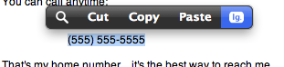

Paul's PopClip extensions
=================

LaunchBarLargeText
------------------

My first PopClip extension!

Uses AppleScript to pass the highlighted text to LaunchBar's "Display in Large Type" and display it in huge text center-screen:

After installing the extension, highlighted text will pop a new action in PopClip:

